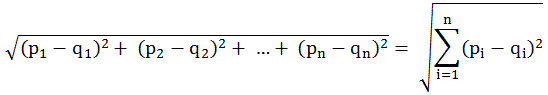

# 벡터 Vectors
> NLP를 딥러닝으로 하는 방법을 공부하면서 벡터에 대해서 좀 더 살펴볼 수 있는 기회가 있었고, 한 무림고수의 비법서를 보면서 그 기초를 짚어가고 있다. 거기에서는 벡터를 '수의 순서쌍'이라고도 불렀다. 방향이 있고 순서가 있고 차원의 공간에 존재하는 점이라고도 할 수 있다.   하나의 리스트에 3개의 값을 넣으면 3차원의 벡터를 표현했다고 볼 수 있다. 그렇다고 list가 벡터인 것은 아니다.   기초적인 것중 하나로 벡터의 차원이 다르면 덧셈을 할 수가 없다. 3차원 벡터 + 4차원 벡터
>    >```
>    >ex. (1, 2, 3) + (1, 2, 3) = (2, 4, 6)     //  (1, 2, 3) + (1, 2)  X
>    >```

# 벡터의 내적 (Dot Product)
> 간단히 말하면 벡터의 각 원소끼리 곱한 후 모두 더한 값을 말한다. 그 값은 스칼라(상수) 형태로 나타난다. ex. (1, 2) * (2, 1) = (1 * 2) + (2 * 1) = 4   내적은 보통 벡터A가 벡터B 방향으로 얼마나 멀리 뻗어나가는지를 나타낸다.
    ```
    a = np.array([1,2,3,4,5])
    b = np.array([2,4,6,8,10])
    print (sum(a*b))    #결과: 110
    ```

# 두 벡터 간의 거리
> 두 벡터 간의 거리를 계산하기 위해서도 많은 것이 필요하지 않다   직관적으로 수식을 입력해도 쉽게 결과 값이 나온다.
>   
>   >```
>   >a = np.array([1,2,3,4,5])
>   >b = np.array([2,4,6,8,10])
>   >print (sum((a-b)**2))**(1/2))  #결과: 7.416198.....
>   >```

# 행렬
> 행렬은 벡터의 모음이라고도 볼 수 있다. 3차원의 벡터가 2개 있으면 2행, 3열의 행렬이 있다고 말할 수 있다. 하나의 벡터 안에서 원소의 값이 같은 성질을 가지며 이러한 벡터가 쌓인 게 행렬이라고도 볼 수 있다. 책에서는 다음의 이유로 행렬이 중요할 것이라고 말한다.
>   - 행렬은 여러 벡터로 구성된 데이터셋으로 표현될 수 있음
>   - k차원의 벡터를 n차원의 벡터로 변환해주는 선형함수를 n x k 행렬로 표현 가능함
>   - 행렬로 이진 관계(binary relationship)를 나타낼 수 있음

# 행렬곱
> 
> 